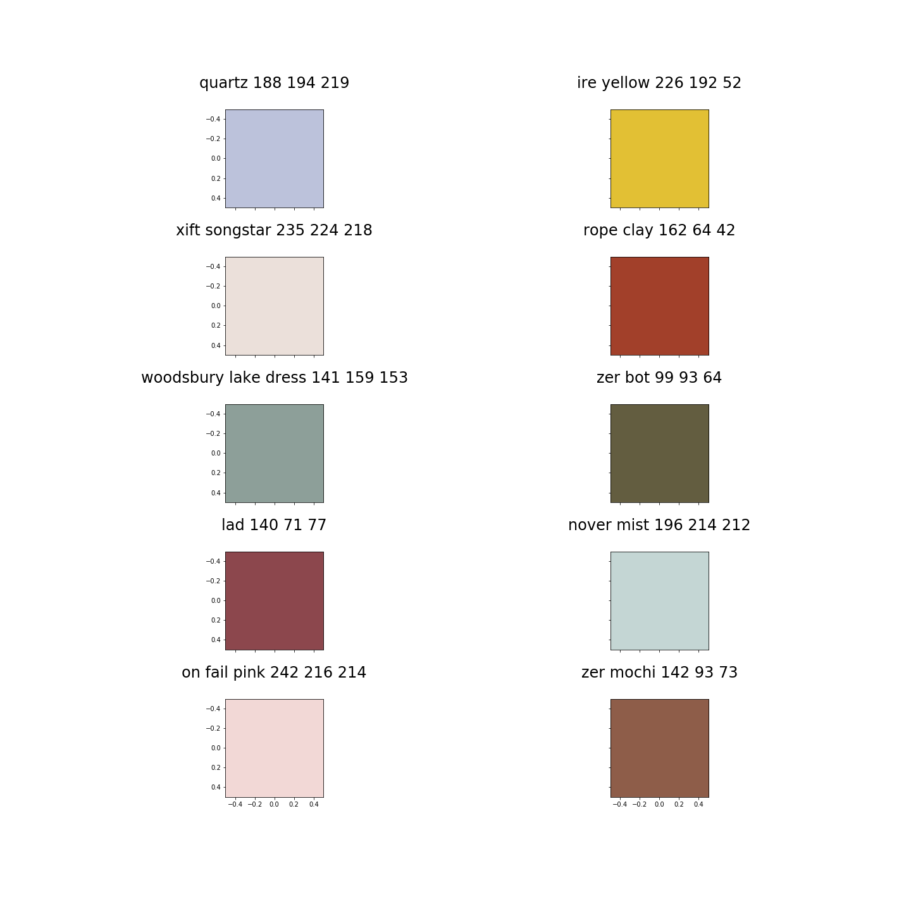

# tf-eager-text-generation

Code from [tensorflow tutorial about text generation](https://github.com/tensorflow/tensorflow/blob/master/tensorflow/contrib/eager/python/examples/generative_examples/text_generation.ipynb) modified to be more flexible + including fun examples.

## Fun examples

You can give your own text file in order to train a text generator :D.

1. run: `python train.py --text-path <path to txt>`, check all the available arguments with `python train.py --help`.
2. run: `python sample.py --text-path <path to txt>`, **including all arguments passed during train**.

### Bands and Artists

1. [get dataset](datasets/bands/)
2. `python train.py --text-path datasets/bands/bands.txt --text-type sentences --num-char-generate 40`

```
The Muriscerd
Tune
Bredie Jamesson
Creed Underson
May
Mol Neic & Gistol
Aika Gray
Indele
Ipu8t
Ignes
R.E.T.H.
Sumpy
Fuster Live
```

### Colors

1. [get dataset](datasets/colors/)
2. `python train.py  --text-path datasets/colors/colors.txt --text-type sentences --num-char-generate 40 --max-length 40`




### Names

1. [get dataset](datasets/names/names.txt)
2. `python train.py --text-path datasets/names/names.txt --text-type sentences --max-length 40 --to-lower`

```
anezenina
amaxdo
pedras
phaudo
bertho
rodomira
ratu
edjulia
eledete
zirdes
```

### Shakespeare

This example was taken from TensorFlow tutorial.

1. [get dataset](datasets/shakespeare/shakespeare.txt)
2. `python train.py --text-path datasets/shakespeare.txt --num-char-generate 100`

```
were to the death of him
And nothing of the field in the view of hell,
When I said, banish him, I will not burn thee that would live.

HENRY BOLINGBROKE:
My gracious uncle--

DUKE OF YORK:
As much disgraced to the court, the gods them speak,
And now in peace himself excuse thee in the world.

HORTENSIO:
Madam, 'tis not the cause of the counterfeit of the earth,
And leave me to the sun that set them on the earth
And leave the world and are revenged for thee.

GLOUCESTER:
I would they were talking with the very name of means
To make a puppet of a guest, and therefore, good Grumio,
Nor arm'd to prison, o' the clouds, of the whole field,
With the admire
With the feeding of thy chair, and we have heard it so,
I thank you, sir, he is a visor friendship with your silly your bed.

SAMPSON:
I do desire to live, I pray: some stand of the minds, make thee remedies
With the enemies of my soul.

MENENIUS:
I'll keep the cause of my mistress.

POLIXENES:
My brother Marcius!

Second Servant:
Will't ple
```

---

The code is orinally from the Tensorflow repository and can be accessed at https://github.com/tensorflow/tensorflow/blob/master/tensorflow/contrib/eager/python/examples/generative_examples/text_generation.ipynb, I just did small modifications.